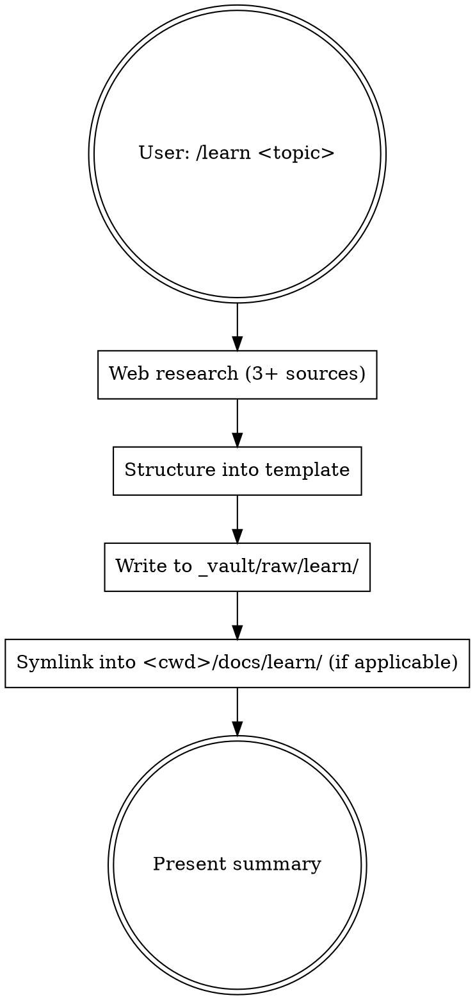

# Learn

Research a topic, structure knowledge, persist to shared vault.

**Input:** `/learn <topic>` — topic is passed as skill args (e.g., `/learn WebSocket pooling`, `/learn eBPF observability`).

## Storage Model (post-#33 vault-primary)

- **Primary:** `~/Documents/pr0j3cts/_vault/raw/learn/<topic-slug>.md` — cross-project knowledge. Obsidian Git auto-syncs. Graphify indexes.
- **Project pointer (optional):** if cwd is inside `~/Documents/pr0j3cts/` (and not `_vault` itself), create relative symlink at `<cwd>/docs/learn/<topic-slug>.md` → vault primary. Portable across Khan's Mac tree.
- **Fallback:** if vault path missing (different Mac, vault not cloned), write primary to `~/.claude/notes/learn/<topic-slug>.md` and skip symlink.

No MCP, no HTTP. Direct `Write` only.

## Workflow



## Rules

1. **ALWAYS web search.** 3+ current sources via WebSearch/WebFetch. Training data may be stale.
2. **ALWAYS persist.** Knowledge unsaved = lost.
3. **ALWAYS use the template.** Consistent format = scannable across topics.
4. **ALWAYS vault-primary.** No duplicate copies — symlink only.
5. **Keep it practical.** "How to use" > "how it works internally." Code > theory.

## Red Flags

- "I'll just explain without searching" — NO. Search first.
- "The file isn't necessary" — NO. Save it.
- "I know this topic well from training" — STILL search. Things change.
- "Let me write a quick summary" — Use the FULL template.

## File Format

**Path:** `~/Documents/pr0j3cts/_vault/raw/learn/<topic-slug>.md`

**Frontmatter + body:**

```markdown
---
id: raw.learn.<topic-slug>
type: raw
source: learn
date: YYYY-MM-DD
summary: "<≤150 chars TL;DR, standalone — Graphify node label>"
---

# <Topic>

> **TL;DR:** 1-3 sentences. The core insight a senior engineer needs.

## Key Concepts

| Concept | What It Is | Why It Matters |
|---------|-----------|----------------|
| ... | ... | ... |

## Patterns & Best Practices

### Pattern 1: Name
- **When:** trigger/situation
- **How:** concise explanation
- **Example:** code or concrete scenario

## Quick Reference

| Task | How |
|------|-----|
| ... | ... |

## Common Mistakes

| Mistake | Why It's Wrong | Do This Instead |
|---------|---------------|-----------------|
| ... | ... | ... |

## Resources

- [Title](url) — why worth reading
- ...

## Context Notes

- Researched on: YYYY-MM-DD
- Sources consulted: N
- Relevance to current project: ...
```

## Write + Symlink Logic (bash)

```bash
SLUG="<topic-slug>"
VAULT="$HOME/Documents/pr0j3cts/_vault/raw/learn"
PRIMARY="$VAULT/$SLUG.md"

# Step 1: ensure vault dir exists, write primary
if [ -d "$HOME/Documents/pr0j3cts/_vault" ]; then
  mkdir -p "$VAULT"
  # Write primary via Write tool (not shown here)
else
  # Fallback: global notes
  PRIMARY="$HOME/.claude/notes/learn/$SLUG.md"
  mkdir -p "$(dirname "$PRIMARY")"
  # Write there instead
fi

# Step 2: if cwd inside ~/Documents/pr0j3cts/ and not _vault, create symlink
CWD="$(pwd)"
PR0J_ROOT="$HOME/Documents/pr0j3cts"
VAULT_DIR="$PR0J_ROOT/_vault"

if [[ "$CWD" == "$PR0J_ROOT"/* && "$CWD" != "$VAULT_DIR"* && -f "$PRIMARY" ]]; then
  PROJ_LEARN="$CWD/docs/learn"
  mkdir -p "$PROJ_LEARN"
  # Compute relative path
  REL=$(python3 -c "import os; print(os.path.relpath('$PRIMARY', '$PROJ_LEARN'))")
  ln -sfn "$REL" "$PROJ_LEARN/$SLUG.md"
  echo "symlink: $PROJ_LEARN/$SLUG.md → $REL"
fi
```

**Notes:**
- Use `ln -sfn` (force, no-deref) — overwrites existing symlink cleanly
- Relative path via `os.path.relpath` — survives moving the whole `pr0j3cts/` tree
- If cwd is `_vault` itself or outside `pr0j3cts/` → skip symlink, primary alone suffices

## After Saving

1. **Report** back to user — MAX 30 lines:
   - TL;DR (1-3 sentences)
   - Key patterns table (name + when to use)
   - Quick reference table
   - Primary path + symlink path (if created)

   Don't dump the whole file — user can read it.

## What Good Looks Like

- 3+ web sources cited with URLs
- Template fully filled (write "N/A" if truly not applicable, don't leave empty)
- Frontmatter correct (`id`, `type: raw`, `source: learn`, `date`, `summary`)
- Primary file in vault; symlink in project `docs/learn/` if applicable
- User sees a scannable summary

## Migration Note

Legacy learn-notes previously stored at `~/.claude/notes/learn/*.md` have been moved to `~/Documents/pr0j3cts/_vault/raw/learn/*.md` (2026-04-19). Old path kept as fallback only when vault unavailable.
