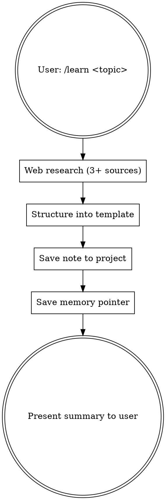

# Learn

Research a topic, structure knowledge, persist for future use.

**Input:** `/learn <topic>` — topic is passed as skill args (e.g., `/learn WebSocket pooling`, `/learn eBPF observability`).

## Workflow



## Rules

1. **ALWAYS web search.** Never rely solely on training data. Use WebSearch/WebFetch to find 3+ current sources. Training data may be stale.
2. **ALWAYS persist.** Save the structured note as a file. Knowledge that isn't saved is knowledge lost.
3. **ALWAYS use the template below.** Consistent format = scannable across topics.
4. **ALWAYS create a memory pointer.** So future sessions can find this knowledge.
5. **Keep it practical.** Focus on "how to use" over "how it works internally." Code examples > theory.

## Red Flags - You're Skipping Steps

- "I'll just explain without searching" — NO. Search first.
- "The file isn't necessary, I'll just respond" — NO. Save it.
- "I know this topic well from training" — STILL search. Things change.
- "Let me write a quick summary" — Use the FULL template.

## Output Template

Save to `docs/learn/<topic-slug>.md` in the current project (create `docs/learn/` if needed). If no project context, save to `~/.claude/notes/learn/<topic-slug>.md`.

```markdown
# <Topic>

> **TL;DR:** 1-3 sentences. The core insight a senior engineer needs.

## Key Concepts

| Concept | What It Is | Why It Matters |
|---------|-----------|----------------|
| ... | ... | ... |

## Patterns & Best Practices

### Pattern 1: Name
- **When:** trigger/situation
- **How:** concise explanation
- **Example:** code or concrete scenario

### Pattern 2: Name
...

## Quick Reference

<!-- Cheat sheet: the part you'll actually revisit in 2 weeks -->

| Task | How |
|------|-----|
| ... | ... |

## Common Mistakes

| Mistake | Why It's Wrong | Do This Instead |
|---------|---------------|-----------------|
| ... | ... | ... |

## Resources

- [Title](url) — why this resource is worth reading
- ...

## Context Notes

<!-- Your specific use case, decisions, or open questions -->

- Researched on: YYYY-MM-DD
- Sources consulted: N
- Relevance to current project: ...
```

## After Saving

1. **Create a reference memory file** at the project's memory directory (or `~/.claude/projects/*/memory/`):
   ```markdown
   ---
   name: learn-<topic-slug>
   description: Learning note on <topic> saved at <path>
   type: reference
   ---

   Learning note: <topic>
   File: <path-to-saved-file>
   Date: YYYY-MM-DD
   ```
   Add pointer to MEMORY.md index. If memory directory doesn't exist or isn't configured, skip — the file itself is the primary artifact.

2. **Present a concise summary** to the user — MAX 30 lines:
   - TL;DR (1-3 sentences)
   - Key patterns table (name + when to use)
   - Quick reference table
   - Path to saved file

   Don't dump the whole file — they can read it.

## What Good Looks Like

- 3+ web sources consulted, cited with URLs
- Template fully filled (no empty sections — write "N/A" if truly not applicable)
- File saved and committed-ready
- Memory pointer created
- User sees a scannable summary, not a wall of text
