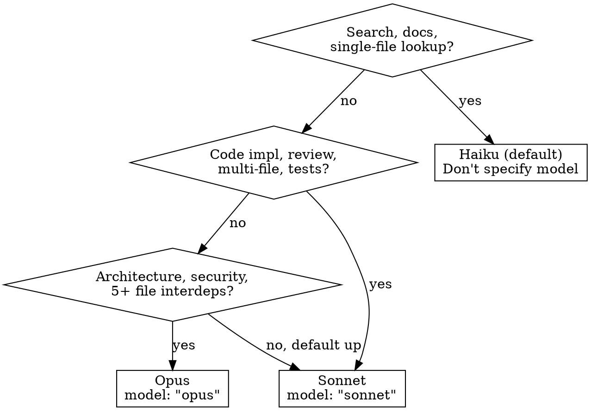

# Model Selection for Subagents

No global model override is set. Choose model per-task using the `model:` param on Agent tool.

## Decision Flow



## Quick Reference

| Model | When | Cost vs Haiku |
|-------|------|---------------|
| **Haiku** | Explore, search, grep, docs, simple lookup, episodic-memory, claude-code-guide | 1x |
| **Sonnet** | Multi-file impl, code review, Plan (task decomp), test writing, build errors | ~4x |
| **Opus** | System architecture, security analysis, complex debugging, 5+ file spans | ~19x |

## Escalation

Bad subagent result → escalate model first, rewrite prompt second.

```
Haiku fails → model: "sonnet"
Sonnet fails → model: "opus"
Opus fails → rethink approach
```

90% Haiku · 5% Sonnet · 5% Opus target.
