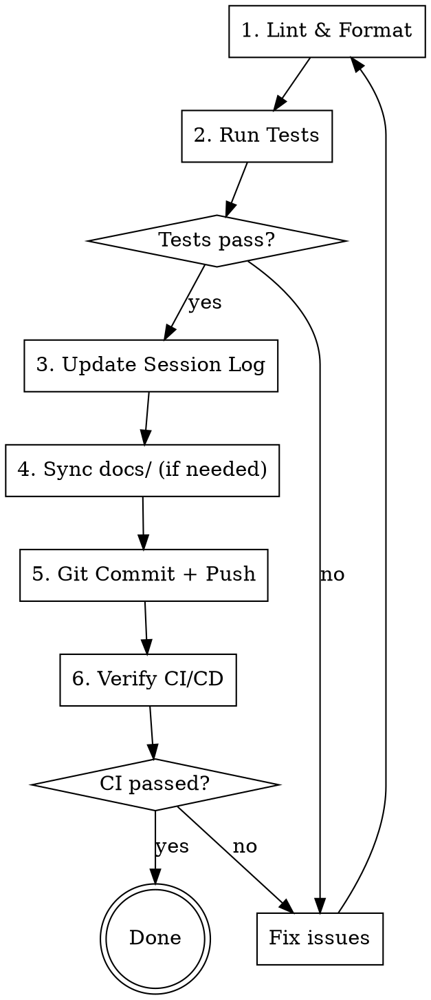

# Point — Checkpoint Save

Atomic save-point: lint → test → log → commit → push → verify CI. One command, zero forgotten steps.

## Workflow



## Steps

### 1. Lint & Format
Detect project type, run appropriate tools:

| Stack | Format | Lint |
|-------|--------|------|
| Python | `ruff format <changed>` | `ruff check --fix <changed>` |
| JS/TS | `prettier --write <changed>` | `eslint --fix <changed>` |
| Go | `gofmt -w <changed>` | `go vet ./...` |

Only run on **changed files** (`git diff --name-only`). Fix all issues before proceeding.

### 2. Run Tests
```bash
# Python
pytest

# JS/TS
npm test

# Go
go test ./...
```

If tests fail — fix and restart from step 1. Do NOT proceed with broken tests.

### 3. Update Session Log
If project has a CLAUDE.md with session logging convention, update it:
- Add/update section `## Сессия DD.MM.YYYY — <description>`
- Include: commits (hash + what/why), lessons (if any), current status
- Continue numbering from previous sessions
- No code blocks in log — describe WHAT and WHY

### 4. Sync docs/
Only if architecture, components, or configuration changed during this session. Skip if only code logic changed.

### 5. Git Commit + Push
- Stage relevant files (NOT `git add -A` — be explicit)
- Never commit `.env`, credentials, or large binaries
- Commit message: English, concise, descriptive
- Push to origin

### 6. Verify CI/CD
```bash
gh run watch
```
If CI fails — read the error, fix, restart from step 1.

## Red Flags — STOP

- Tests failing → fix before commit
- Uncommitted secrets → remove from staging
- No project CLAUDE.md → skip step 3, warn user
- CI not configured → skip step 6, warn user

## What This Is NOT

- NOT `/save-context` (memory/facts persistence)
- NOT `/finish` (behavioral learning + instincts)
- NOT `/reflect` (session analysis)

Point saves **code state**. The others save **knowledge state**.
