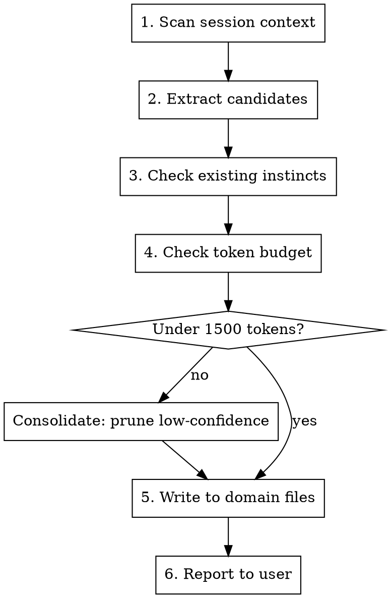

# Reflect — Extract Behavioral Instincts

Analyze the current session and extract reusable behavioral instincts from user corrections, confirmed patterns, and decisions. Instincts persist as rules loaded in future sessions.

## Algorithm



### Step 1: Scan Session Context

Look for these signals in conversation:

| Signal | Type | Example |
|--------|------|---------|
| User says "нет", "не так", "стоп", "используй X" | **correction** | "don't mock the database" |
| User says "да", "отлично", "именно", accepts approach | **confirmation** | "yes, single PR was right" |
| Same approach worked 2+ times | **pattern** | Always ran tests before push |
| Explicit "we chose X because Y" | **decision** | "ruff over black for speed" |
| Tool/format preference (explicit or implicit) | **preference** | "keep responses short" |

### Step 2: Extract Candidates

For each signal, determine:
- **domain**: programming, devops, design, security, workflow, tools (or new if none fit)
- **scope**: `global` (universal) or `project` (specific to this codebase)
- **storage**: `rules` (universal, always loaded) or `knowledge` (domain-specific, lazy-loaded)
- **confidence**: see scale below
- **instinct-id**: short kebab-case identifier

**Storage decision:**
- `~/.claude/rules/learned/` — instincts that apply to EVERY session (workflow, tools). Always loaded = costs tokens every time.
- `~/.claude/knowledge/` — domain-specific instincts (design, research, writing, devops, marketing). Loaded on demand when entering that domain. Saves tokens.
- Rule of thumb: if the instinct is only relevant when doing a specific type of work → knowledge/. If it's always relevant → rules/learned/.

**Confidence scale:**

| Signal strength | Confidence |
|----------------|-----------|
| One observation, implicit | 0.5 |
| Explicit user correction | 0.7 |
| Confirmed pattern (2+ times) | 0.8 |
| Direct instruction "always do X" | 0.9 |

**Skip** if confidence < 0.5. **Max 10 instincts** per /reflect invocation.

Priority: corrections > decisions > patterns > preferences.

### Step 3: Deduplicate

Read existing instinct files:
- Global always-loaded: `~/.claude/rules/learned/*.md`
- Global lazy-loaded: `~/.claude/knowledge/*.md`
- Project: `<project>/.claude/rules/learned/*.md`

If instinct already exists → bump confidence (+0.1, max 0.9), update date. Do NOT create duplicate.

### Step 4: Token Budget Check

```bash
wc -l ~/.claude/rules/learned/*.md 2>/dev/null | tail -1
# Target: < 100 lines total
```

**Budget: 1500 tokens max** (~100 lines) across all global instinct files.

If over budget → consolidate before adding:
1. Delete instincts with confidence < 0.6
2. Merge similar instincts (keep highest confidence)
3. Archive instincts >2 months old with confidence < 0.7
4. If still over → replace lowest confidence instinct

### Step 5: Write Instincts

**Storage paths:**
- Always-loaded (workflow, tools): `~/.claude/rules/learned/<domain>.md`
- Lazy-loaded (design, research, writing, devops, etc): `~/.claude/knowledge/<domain>.md`
- Project-specific: `<project>/.claude/rules/learned/<domain>.md`

**Create directories lazily** — only when first instinct for that scope is written.

**Format — compact one-liner:**

```markdown
# <Domain> Instincts

<!-- Format: confidence | trigger → action (source, date) -->
0.8 | deploying code → always verify CI before push (correction, 2026-03-28)
0.7 | writing Python → prefer ruff over black (pattern, 2026-03-25)
```

One line per instinct. No verbose metadata blocks.

### Step 6: Report

Output to user:

```
Extracted N instincts:
  [domain] +new: instinct-id (confidence)
  [domain] ↑: instinct-id (old → new confidence)
  [domain] =skip: instinct-id (already exists)
Saved to: ~/.claude/rules/learned/ (N always-loaded), ~/.claude/knowledge/ (N lazy-loaded), .claude/rules/learned/ (N project)
Token budget: XX/100 lines used
```

If nothing extracted: `No instincts to extract from this session.`

## Edge Cases

| Situation | Action |
|-----------|--------|
| Empty session (only Q&A) | Report "No instincts to extract" |
| Contradicts existing instinct | Update existing, add note. Higher confidence wins |
| No domain fits | Create new domain file (e.g., `ml.md`) |
| Token budget exceeded | Forced consolidation before adding |
| /reflect called twice | Dedup prevents duplicates |

## What This Is NOT

- NOT `/save-context` — that saves session facts (logs, lessons)
- NOT `/point` — that saves code state (lint, test, commit)
- `/reflect` saves **behavioral patterns** for future Claude instances
